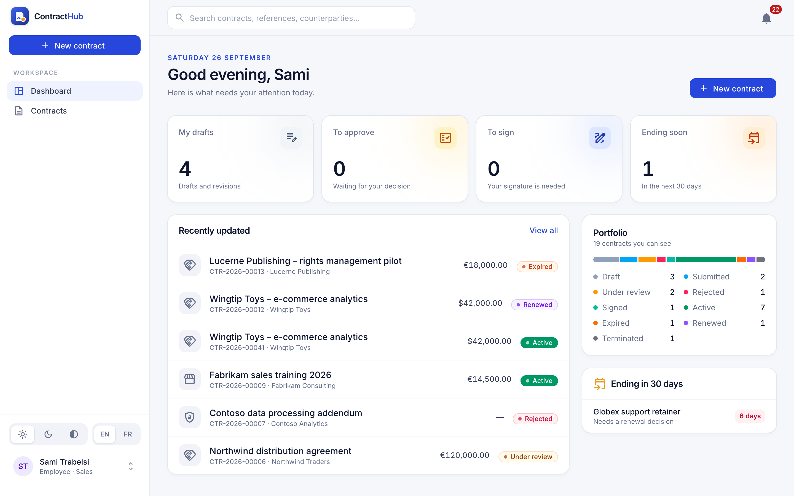

# Contract Hub

A contract lifecycle management platform: draft contracts, route them through
configurable multi-step approval chains, collect e-signatures, and track
renewals and expirations, with a complete, tamper-proof audit trail.

> 🚧 Work in progress. Built incrementally; see the roadmap below.

<!-- Screenshot placeholders: replace once the UI is built -->
<!--  -->
<!--  -->

## Tech stack

| Layer    | Choice |
| -------- | ------ |
| API      | Node.js, Express 5, TypeScript, Zod |
| Database | PostgreSQL + Prisma 7 |
| Web      | Angular 22 (standalone components, signals), Angular Material 3, Tailwind CSS 4 |
| Auth     | JWT access tokens + rotating refresh tokens (httpOnly cookie), RBAC |
| Jobs     | Postgres-backed queue (`FOR UPDATE SKIP LOCKED`), no Redis |
| Email    | Nodemailer → Mailpit in development |

## Repository layout

```
apps/api        Express API (controllers → services → repositories)
apps/web        Angular front-end (feature folders, lazy routes)
packages/shared Domain enums + contract state-transition table, shared by both apps
docs/           Architecture & design decisions
```

See **[docs/ARCHITECTURE.md](docs/ARCHITECTURE.md)** for the data model, the
workflow engine design, and the reasoning behind each decision.

## Getting started

Prerequisites: Node 22+, and either Docker or a local PostgreSQL 14+.

```bash
npm install
cp apps/api/.env.example apps/api/.env   # adjust DATABASE_URL if not using Docker
npm run db:up                            # Postgres + Mailpit (skip if using local Postgres)
npm run db:migrate                       # apply migrations + generate Prisma client
npm run db:seed                          # demo departments & users
npm run dev:api                          # http://localhost:3000/api/health
npm run dev:web                          # http://localhost:4200 (proxies /api → :3000)
```

Emails sent in development appear in Mailpit at http://localhost:8025.

### Demo accounts

All demo accounts use the password **`Demo1234!`**.

| Email | Role | Department |
| ----- | ---- | ---------- |
| admin@contracthub.dev | Admin | Operations |
| legal@contracthub.dev | Legal (dept. head) | Legal |
| finance@contracthub.dev | Finance (dept. head) | Finance |
| sales.manager@contracthub.dev | Manager | Sales |
| sales@contracthub.dev | Employee | Sales |
| procurement.manager@contracthub.dev | Manager | Procurement |
| procurement@contracthub.dev | Employee | Procurement |

### Tests

```bash
npm test                                  # unit + integration
npm test -w @cms/api -- --project unit    # unit only, no database needed
```

Integration tests run against `TEST_DATABASE_URL` (a separate database, created
automatically by Docker; with a local Postgres run `createdb contract_mgmt_test`).
They are migrated before each run and never wipe data: every test creates its own
uniquely named records.

### Useful scripts

| Command | What it does |
| ------- | ------------ |
| `npm test` | Unit tests for all workspaces |
| `npm run typecheck` | Type-check all workspaces |
| `npm run db:seed` | Load demo departments, users, approval policies and draft contracts |
| `npm run db:studio -w @cms/api` | Browse the database in Prisma Studio |

## API overview

All routes are under `/api` and need `Authorization: Bearer <access token>`.

| Area | Endpoints |
| ---- | --------- |
| Contracts | `GET /contracts` (filter: `q`, `status`, `type`, `departmentId`, `counterpartyId`, `ownerId`, `endsBefore`; `sort`, `order`, `page`, `pageSize`) · `POST /contracts` · `GET /contracts/:id` · `PATCH /contracts/:id` (needs `expectedVersion`) |
| History | `GET /contracts/:id/versions` · `GET /contracts/:id/versions/:n` · `GET /contracts/:id/versions/diff?from=1&to=2` · `GET /contracts/:id/timeline` |
| Files | `GET /contracts/:id/versions/:n/document` · `POST /contracts/:id/attachments` · `GET …/attachments/:attId/download` · `DELETE …/attachments/:attId` |
| Workflow | `GET /contracts/:id/approval-preview` · `POST /contracts/:id/submit` · `POST /contracts/:id/withdraw` · `POST /contracts/:id/reopen` · `GET /contracts/:id/approvals` |
| Approvers | `GET /approvals/pending` · `POST /approvals/steps/:stepId/approve` · `POST /approvals/steps/:stepId/reject` (reason required) |
| Signatures | `GET/PUT /contracts/:id/signers` · `POST /contracts/:id/sign` · `POST /contracts/:id/decline-signature` · `GET /signers` (who may sign) |
| External signing (no login; the emailed link is the credential) | `GET /signing/:token` · `GET /signing/:token/document` · `POST /signing/:token/sign` · `POST /signing/:token/decline` |
| Notifications | `GET /notifications` · `GET /notifications/unread-count` · `POST /notifications/:id/read` · `POST /notifications/read-all` |
| Audit (Legal, Admin) | `GET /audit` (filter by `action`, `userId`, `contractId`, `from`, `to`; cursor `before`) · `GET /contracts/:id/audit` |
| Admin | `GET/POST /workflow-templates` · `GET/PUT/DELETE /workflow-templates/:id` · `POST /approvals/escalations/run` |
| Home | `GET /dashboard` |
| Reference | `GET/POST /counterparties` · `GET /departments` |

`POST /contracts` and `PATCH /contracts/:id` accept JSON, or `multipart/form-data`
with the JSON in a `data` field and the contract file (PDF/DOCX/DOC) in `document`.

### Walkthrough

Open http://localhost:4200. The login page has one-click buttons for the demo accounts.

1. **Sami (employee)** opens "Acme Cloud hosting 2027" (45,000 USD). The
   *Approvals* tab previews the policy: Manager, then Legal and Finance in
   parallel (Finance applies above 10,000); executive sign-off is skipped with
   its reason. Submit it.
2. **Sarah (Sales manager)** gets a notification in the bell and approves.
   Legal and Finance open at the same time.
3. **Leila (Legal)** and **Farah (Finance)** approve from their *Approvals* page.
   The contract is approved.
4. **Sami** opens *Signatures*, picks Sarah plus an external signer.
5. **Sarah** signs (typed or drawn). The external signer's email, with their
   personal link, lands in Mailpit (http://localhost:8025, start it with
   `docker compose up -d mailpit`); the link opens a public signing page.
6. Once everyone signed, the contract is *Signed* (or *Active* if its start date
   has passed). **Leila** can see the full audit trail under *Activity*.

The procurement draft "Office supplies framework" (8,000 USD) shows Finance
being skipped, with the reason recorded.

## Roadmap

- [x] Monorepo, database schema, migrations with DB-level guarantees
- [x] Auth (JWT + refresh-token rotation with reuse detection) and RBAC
- [x] Contracts CRUD with version history and file storage
- [x] Approval workflow engine (state machine, conditional steps, escalation)
- [x] Notifications (email job queue + in-app bell) and audit logging
- [x] Angular UI: login, dashboard, contract detail, approvals, e-signature
- [ ] Seed data and demo walkthrough
