# Contract Hub

[](https://github.com/Eya2/contract_management/actions/workflows/ci.yml)

**Agreements, approved. Signed. Renewed. On time.**

Contract Hub is a full-stack contract lifecycle management platform. Teams draft
contracts, route them through configurable multi-step approval chains, collect
legally evidenced e-signatures, and never miss a renewal. Every step leaves a
tamper-proof audit trail.


<table>
  <tr>
    <td>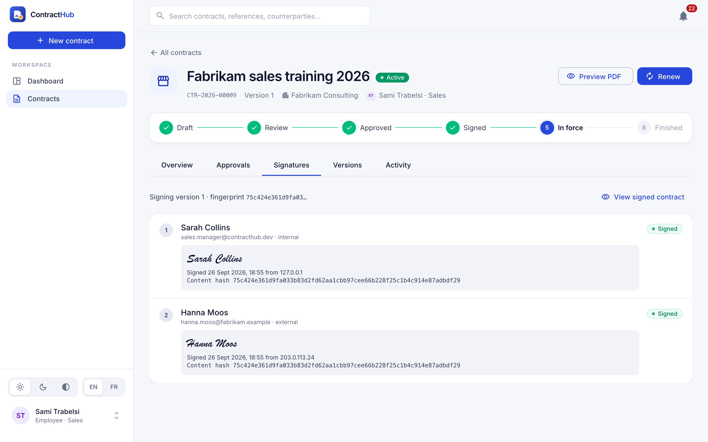</td>
    <td>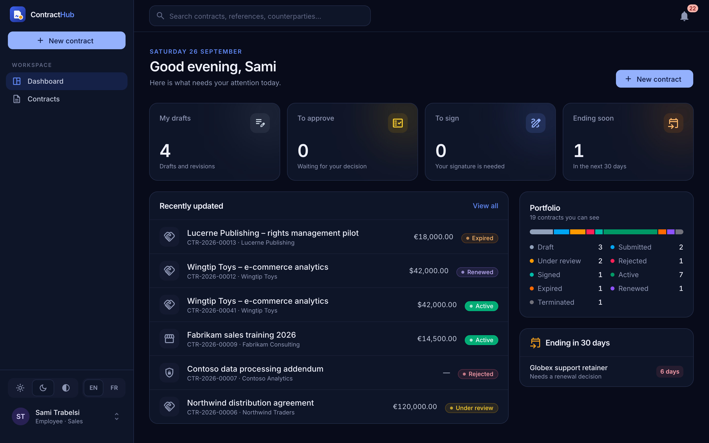</td>
  </tr>
  <tr>
    <td align="center"><sub>Signatures with their evidence</sub></td>
    <td align="center"><sub>Dark mode</sub></td>
  </tr>
</table>

---

## Contents

- [Features](#features)
- [Screenshots](#screenshots)
- [Quick start](#quick-start)
- [Run everything with Docker](#run-everything-with-docker)
- [Demo walkthrough](#demo-walkthrough)
- [Email delivery (Mailpit or Gmail)](#email-delivery)
- [Tech stack and architecture](#tech-stack-and-architecture)
- [Security](#security)
- [API overview](#api-overview)
- [Tests and scripts](#tests-and-scripts)
- [Project structure](#project-structure)

---

## Features

### Contracts

- **Create and edit** contracts with a clause editor, key terms (value, currency, dates, auto-renewal) and an optional uploaded document (PDF/DOCX).
- **Immutable version history**: every save is a new version. Old versions stay readable and can be **compared side by side** (fields and clauses).
- **Optimistic concurrency**: two people editing the same contract can't overwrite each other.
- **A real contract PDF**, generated from each version, with parties, key terms, numbered clauses, signature blocks and page numbering. It comes in **English or French**, with a *DRAFT* watermark until approval. [Sample signed PDF](docs/samples/signed-contract-en.pdf) · [Version française](docs/samples/signed-contract-fr.pdf)
- **In-app preview at every step** (draft, review, approval, signing, signed) without downloading anything.
- **Attachments**, search, filters, sorting, pagination, **CSV export**, and termination with a reason.

### Approval workflow

- **Configurable policies**: stages run one after another, and steps inside a stage run in parallel. The most specific policy applies (type + department → type → department → default).
- **Conditional steps**, e.g. *Finance only above 10,000*, with the reason recorded when a step is skipped. A missing value never skips a step: the engine uses three-valued logic.
- **Segregation of duties**: nobody approves their own contract. If the requester is the only eligible approver, the step is routed to the department head or an admin, with a note explaining why.
- **Escalation** of overdue steps to the department head, then the admins, exactly once per level.
- **Any approver can veto**: a rejection closes the round with its reason. The owner revises and resubmits, and every round stays on record.

### E-signature

- Colleagues sign from their account. **External parties sign through a personal emailed link** without needing an account.
- Signing follows a **signing order**. Signatures can be **drawn** (signature pad, mouse or touch) or **typed**, with explicit consent.
- **Evidence** for every signature: time, IP address, device, and the SHA-256 fingerprint of the exact content the signer saw. A contract that changed after being opened can't be signed.
- Signatures are **stamped into the PDF**, followed by a **signature certificate** page and the approval trail.
- Once fully signed, the contract becomes **Active**, or **Signed** until its start date, when it activates automatically.

### Renewals

- **Reminders at 30, 7 and 1 days** before the end date, to the owner and the department head. Each reminder is sent exactly once.
- At the end of the term: **automatic renewal** on the same terms, **renewed** (if a renewal was already signed), or **expired**.
- **Manual renewal** creates a draft for the next term, with calendar-aware dates (whole months stay whole months, including across leap years).

### Notifications and audit

- An **in-app bell** with a live unread count, plus a full notifications page.
- **Email** for every event, delivered through a Postgres job queue with retries. An admin screen shows what was sent, queued or failed, and can retry.
- An **append-only audit log**: the database itself refuses `UPDATE` and `DELETE`. Every sign-in, view, download, decision and signature is recorded with the user and IP.

### Administration

- **People & teams**: create users, change roles and departments, deactivate, reset passwords, and choose department heads. Admins can't lock themselves out.
- **Approval policy editor** with a visual stage pipeline and a condition builder.
- **Email delivery** monitor and **audit log** explorer.

### Accounts and experience

- **Keep me signed in** (a 30-day session) or a browser session. **Forgot password** with a single-use, one-hour email link. **Change password** signs out every other device.
- **English and French**, switchable instantly (dates and amounts follow the language). **Light, dark and system themes**, a responsive layout (works on phones), subtle animations that respect *reduced motion*, and loading skeletons and empty states throughout.

---

## Screenshots

| | |
|---|---|
| 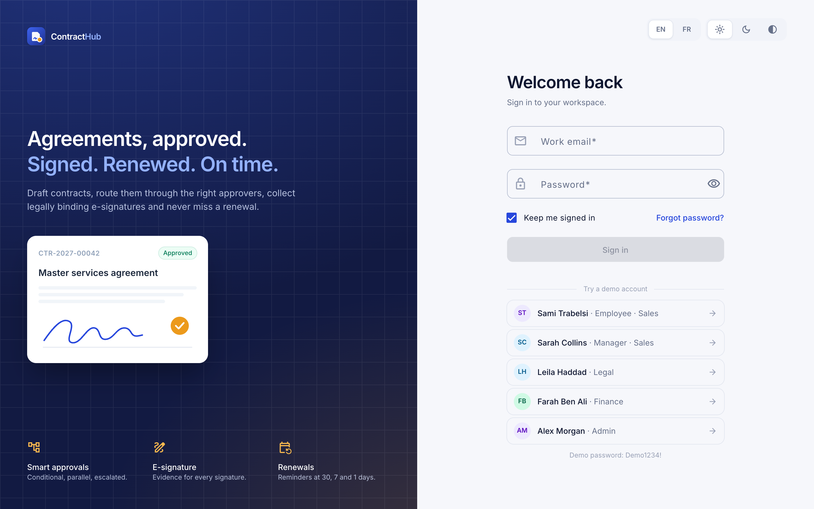 **Sign in**: demo accounts in one click | 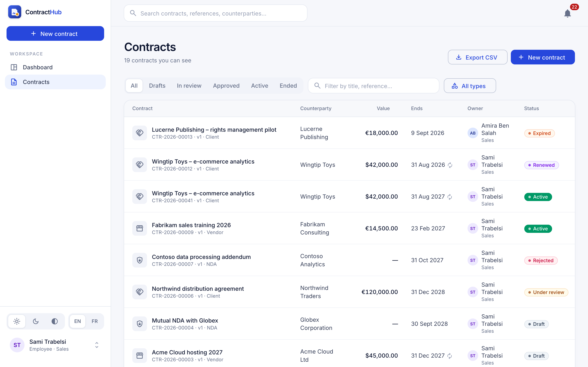 **Contracts**: views, search, filters, export |
| 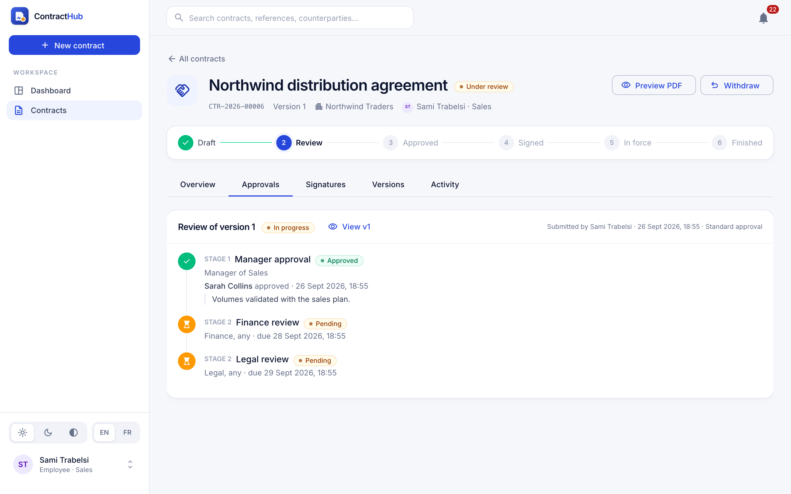 **Approvals**: stages, parallel steps, deadlines | 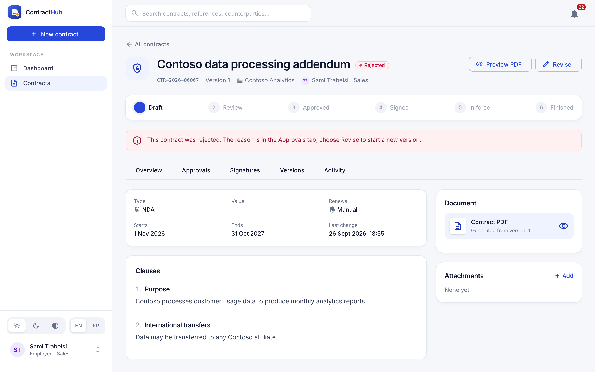 **Rejection** with the reason and a clear next step |
| 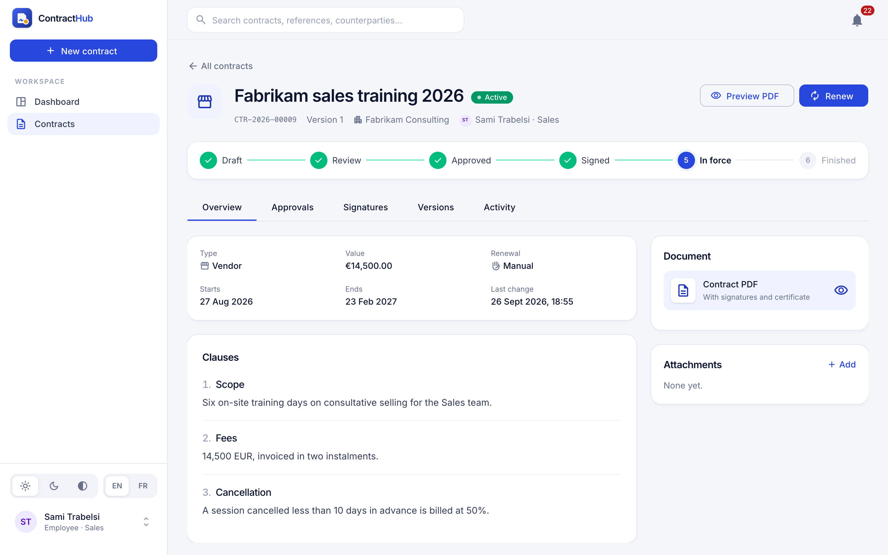 **A contract in force**, with its lifecycle | 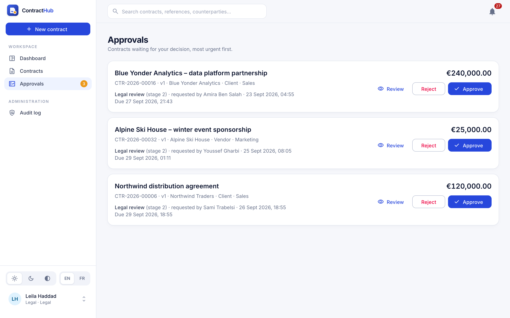 **Approver's queue**, most urgent first |
| 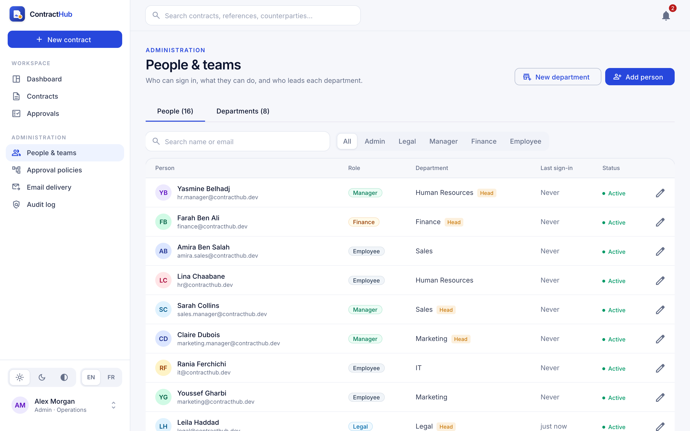 **People & teams** | 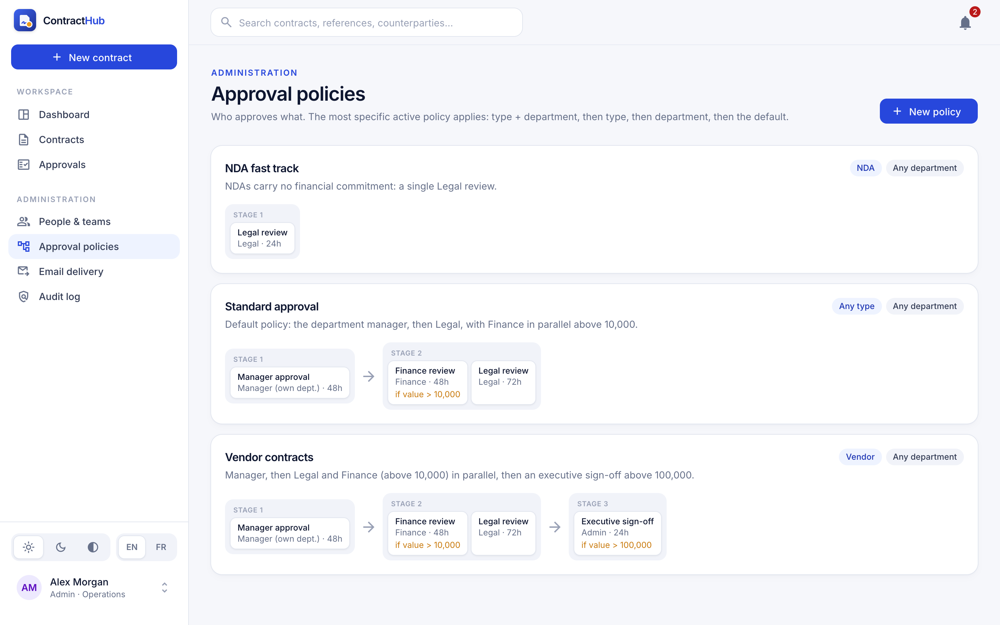 **Approval policies** |
| 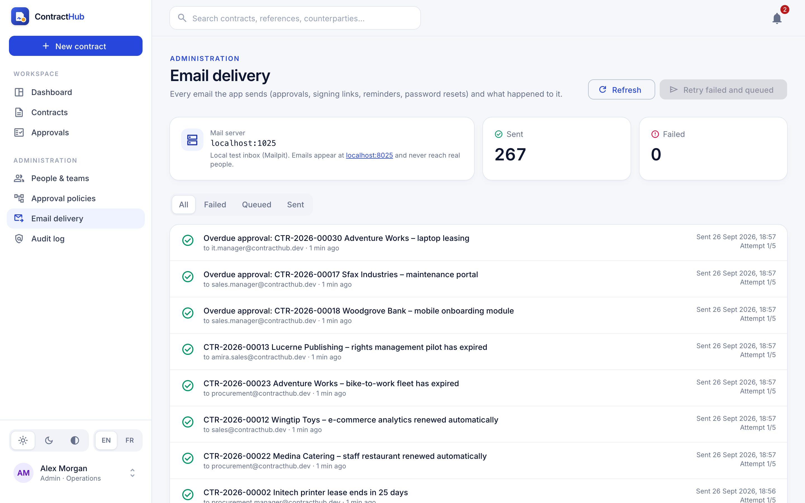 **Email delivery** | 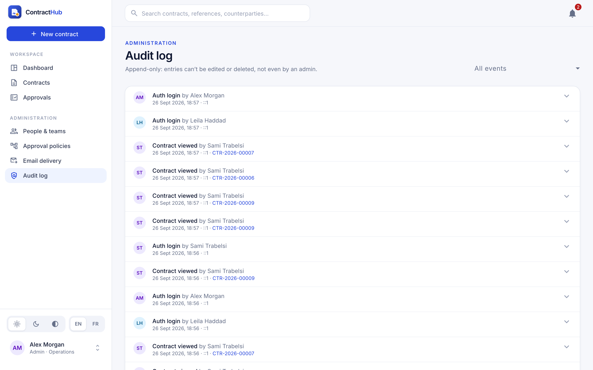 **Audit log** |
| 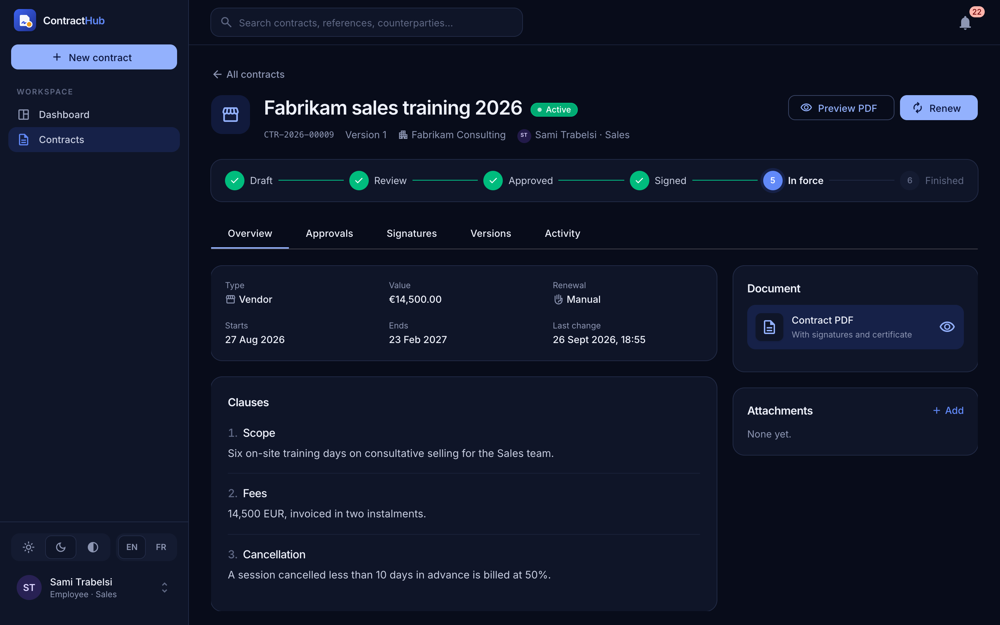 **Dark mode** | 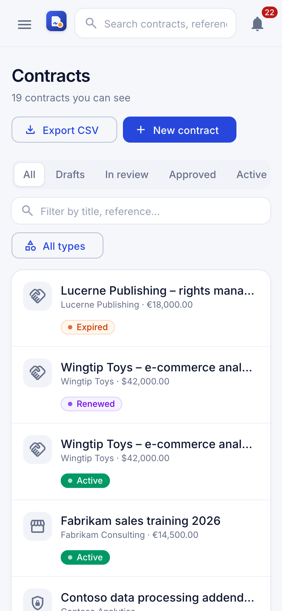 **On a phone** |

Screenshots are generated from the seeded demo data by `npm run screenshots` (see [Tests and scripts](#tests-and-scripts)).

---

## Quick start

Prerequisites: **Node 22 or 24**, and either **Docker** or a local **PostgreSQL 14+**.

```bash
npm install
cp apps/api/.env.example apps/api/.env   # adjust DATABASE_URL if you use a local Postgres
npm run db:up                            # Postgres + Mailpit in Docker (skip Postgres if you have one)
npm run db:migrate                       # create the schema
npm run db:seed                          # demo users, policies and contracts at every stage
npm run dev:api                          # API on http://localhost:3000
npm run dev:web                          # app on http://localhost:4200
```

With a local PostgreSQL instead of Docker, start only the mail catcher: `docker compose up -d mailpit`.

## Run everything with Docker

The whole app (database, API, web app and mail catcher) runs with Docker
Compose. No Node.js needed.

```bash
echo "JWT_ACCESS_SECRET=$(openssl rand -base64 48)" > .env   # once; .env is git-ignored
docker compose --profile app up -d --build                   # http://localhost:8080
docker compose --profile app run --rm seed                   # load the demo data (once)
```

- The app is on http://localhost:8080 and emails land in Mailpit at http://localhost:8025.
- If port 5432 is already taken (e.g. a local PostgreSQL), add `POSTGRES_PORT=55432` to `.env`.
- The API container applies database migrations on every start. Uploaded files live in the `storage` volume.
- For real email, add the SMTP settings from [Email delivery](#email-delivery) to `.env`.
- Stop with `docker compose --profile app down` (add `-v` to also delete the data).

The images are built by CI and published on every push to `main`:
`ghcr.io/eya2/contract_management-api` and `ghcr.io/eya2/contract_management-web`.

| Image | Contents |
| ----- | -------- |
| `apps/api/Dockerfile` | Multi-stage Node 24 build, production dependencies only, runs as a non-root user, health check, migrations on start |
| `apps/web/Dockerfile` | Angular production build served by nginx, which also forwards `/api` to the API (one origin: cookies work unchanged) |

### Demo accounts

All demo accounts use the password **`Demo1234!`**. The sign-in page has one-click buttons for each.

| Account | Role | What to try |
| ------- | ---- | ----------- |
| `sales@contracthub.dev` (Sami) | Employee, Sales | Draft, submit, revise, choose signers, renew |
| `sales.manager@contracthub.dev` (Sarah) | Manager, Sales (head) | Approve Sales contracts, sign, terminate |
| `legal@contracthub.dev` (Leila) | Legal (head) | Review every contract, read the audit log |
| `finance@contracthub.dev` (Farah) | Finance (head) | Review contracts above 10,000 |
| `procurement@contracthub.dev` (Nour) | Employee, Procurement | Vendor contracts |
| `procurement.manager@contracthub.dev` (Omar) | Manager, Procurement (head) | Approve and sign Procurement contracts |
| `admin@contracthub.dev` (Alex) | Admin | Users, policies, email delivery, audit |

More people to explore other departments: `amira.sales@`, `finance2@`, `hr.manager@` / `hr@`,
`it.manager@` / `it@`, `marketing.manager@` / `marketing@` (all `@contracthub.dev`, same password).

---

## Demo walkthrough

The seed builds a realistic workspace: **8 departments, 16 people, about 25
counterparties** (companies in six countries, plus future employees) and **about
40 contracts** in EUR, USD, GBP and TND. They cover client and vendor agreements,
NDAs and employment contracts, in every state: in force, expired, renewed
automatically, terminated with a reason, awaiting signature, partly approved,
overdue and escalated, rejected, revised as version 2, withdrawn, and drafts
with an edit history.

Every contract is taken through the real workflow (the same services the app
uses), so versions, timelines, approvals, signatures and notifications are
genuine. The history is then spread over the past 18 months. (Audit log entries
keep the date the seed ran: the database doesn't allow them to be edited.)

A few to start with:

| Contract | State | What it shows |
| -------- | ----- | ------------- |
| Acme Cloud hosting 2027 | Draft, 45,000 USD | The full flow from scratch |
| Northwind distribution agreement | Under review | Manager approved; Legal and Finance deciding in parallel |
| Contoso data processing addendum | Rejected | Legal's reason; revise and resubmit |
| Fabrikam process audit | Approved | Waiting for an internal, then an external signature |
| Fabrikam sales training 2026 | Active | Signed by both parties: signed PDF and certificate |
| Globex support retainer | Active, ends in 6 days | Renewal reminders, manual renewal |
| Initech printer lease | Active, auto-renews | Automatic renewal at the end of the term |

**A 10-minute tour:**

1. **Sami** (employee) opens *Acme Cloud hosting 2027* → **Approvals** tab. The preview shows which policy applies and which steps are skipped, and why. Click **Preview PDF** to see the generated contract, then **Submit for approval**.
2. **Sarah** (Sales manager) gets a notification in the bell. It opens the contract on its Approvals tab. **Review document**, then **Approve**. Legal and Finance now run in parallel.
3. **Leila** (Legal) and **Farah** (Finance) approve from their **Approvals** queue. The contract is approved.
4. **Sami** opens **Signatures** → **Choose signers**: Sarah, plus an external signer with any email address.
5. **Sarah** signs by drawing on the signature pad. The external signer's email appears in Mailpit (http://localhost:8025). Open the link: the signer reads the contract as a PDF and signs without an account.
6. The contract is now **Signed**. **View signed contract** shows both signatures stamped in, plus the certificate page.
7. **Leila** opens *Contoso data processing addendum* to read a rejection. On *Fabrikam sales training 2026* → **Activity**, the full audit trail is visible.
8. **Alex** (admin) explores **People & teams**, edits a **policy** (for example, lowers the Finance threshold), checks **Email delivery** and the **Audit log**.

Try the light/dark switch at the bottom of the sidebar, and the app on a phone-sized window.

---

## Email delivery

Every email (approval requests, signing links, reminders, password resets) goes
through a job queue. Admins can see what happened to each one under
**Administration → Email delivery**, and retry failed ones.

### Development: Mailpit (default)

Mailpit catches every email in a local inbox: http://localhost:8025. Nothing
reaches real people.

```bash
docker compose up -d mailpit
```

### Real delivery with Gmail

1. In your Google account, turn on **2-Step Verification**: https://myaccount.google.com/signinoptions/two-step-verification
2. Create an **app password**: https://myaccount.google.com/apppasswords. Name it "Contract Hub" and copy the 16-character password. It's shown once.
3. In `apps/api/.env`, replace the SMTP lines. Use your own address and paste the app password (the spaces can stay or go):
   ```dotenv
   SMTP_HOST=smtp.gmail.com
   SMTP_PORT=587
   SMTP_SECURE=false
   SMTP_USER=you@gmail.com
   SMTP_PASS=abcdefghijklmnop
   MAIL_FROM="Contract Hub <you@gmail.com>"
   ```
4. Restart the API (`npm run dev:api`).
5. Check it: **Administration → Email delivery** shows `smtp.gmail.com:587` as *Real delivery*. Anything that failed earlier can be sent again with **Retry failed and queued**.

Notes:
- Never commit `apps/api/.env` (it's git-ignored). An app password is as sensitive as your password: revoke it at the same page if it leaks.
- Gmail sends at most about 500 emails a day from a personal account. For production, use a transactional provider (Postmark, SendGrid, Amazon SES…): it's the same SMTP settings with their host and credentials.
- Links in emails use `APP_URL` (default `http://localhost:4200`). For people outside your machine, set it to the address where the app is reachable.

---

## Tech stack and architecture

| Layer    | Choice |
| -------- | ------ |
| API      | Node.js, Express 5, TypeScript, Zod |
| Database | PostgreSQL + Prisma 7 |
| Web      | Angular 22 (zoneless, standalone components, signals), Angular Material 3, Tailwind CSS 4 |
| Auth     | JWT access tokens (memory only) + rotating refresh tokens (httpOnly cookie), RBAC |
| Jobs     | Postgres-backed queue (`FOR UPDATE SKIP LOCKED`), no Redis |
| PDF      | PDFKit, rendered on demand from immutable versions |
| Email    | Nodemailer → Mailpit in development, any SMTP provider in production |

Highlights of the design (details and reasoning in **[docs/ARCHITECTURE.md](docs/ARCHITECTURE.md)**):

- **Current state plus immutable history.** Contract versions are insert-only. Approvals and signatures point at the exact version and content hash they cover.
- **A pure workflow engine.** Template selection, conditions, stages, decisions and escalation are plain functions, tested exhaustively. The service wraps them in transactions, with a per-contract row lock so parallel approvals can't race.
- **Transactional outbox.** Emails and notifications are written in the same transaction as the change that causes them. A rolled-back action never emails anyone, and a committed one always does.
- **Idempotent schedulers.** Escalations, reminders, activation and renewals use compare-and-set updates and dedupe keys, so running them twice (or on two servers) never double-acts.
- **Shared domain types.** `@cms/shared` holds the status enums and the lifecycle transition table, used by both the API and the web app.

---

## Security

- **Passwords** are hashed with Argon2id. Login answers identically for unknown emails and wrong passwords, and is rate-limited.
- **Sessions**: short-lived access tokens kept in memory, and refresh tokens rotated on every use with **reuse detection** (a replayed token revokes the whole session). Cookies are `httpOnly`, `SameSite=Strict` and path-scoped.
- **Password reset**: 256-bit single-use tokens stored as hashes, valid for one hour. Requesting a link never reveals whether an account exists. A reset signs out every session.
- **Authorization** in two layers: role permissions, then record-level visibility (department, ownership, approver or signer). Contracts outside your scope are indistinguishable from missing ones.
- **Uploads** are checked by extension allowlist *and* file signature (magic bytes), and served with `nosniff`.
- **CSV export** neutralises spreadsheet formula injection.
- **Audit log** is append-only at the database level (a trigger rejects `UPDATE`, `DELETE` and `TRUNCATE`).

---

## API overview

All routes are under `/api` and need `Authorization: Bearer <access token>`,
except authentication and the external signing links.

| Area | Endpoints |
| ---- | --------- |
| Auth | `POST /auth/login` (`remember`) · `POST /auth/refresh` · `POST /auth/logout` · `GET/PATCH /auth/me` · `POST /auth/forgot-password` · `GET/POST /auth/reset-password` · `POST /auth/change-password` |
| Contracts | `GET /contracts` (filters, sort, paging) · `GET /contracts/export.csv` · `POST /contracts` · `GET /contracts/:id` · `PATCH /contracts/:id` (`expectedVersion`) · `POST /contracts/:id/terminate` · `POST /contracts/:id/renew` |
| History | `GET /contracts/:id/versions` · `GET /contracts/:id/versions/:n` · `GET /contracts/:id/versions/diff?from=&to=` · `GET /contracts/:id/timeline` |
| Documents | `GET /contracts/:id/versions/:n/pdf?lang=en\|fr` · `GET …/versions/:n/document` · `POST /contracts/:id/attachments` · `GET …/attachments/:attId/download` · `DELETE …/attachments/:attId` |
| Workflow | `GET /contracts/:id/approval-preview` · `POST /contracts/:id/submit` · `POST /contracts/:id/withdraw` · `POST /contracts/:id/reopen` · `GET /contracts/:id/approvals` |
| Approvers | `GET /approvals/pending` · `POST /approvals/steps/:stepId/approve` · `POST /approvals/steps/:stepId/reject` |
| Signatures | `GET/PUT /contracts/:id/signers` · `POST /contracts/:id/sign` · `POST /contracts/:id/decline-signature` · `GET /signers` |
| External signing | `GET /signing/:token` · `GET /signing/:token/pdf` · `POST /signing/:token/sign` · `POST /signing/:token/decline` |
| Notifications | `GET /notifications` · `GET /notifications/unread-count` · `POST /notifications/:id/read` · `POST /notifications/read-all` |
| Admin | `GET/POST /users` · `PATCH /users/:id` · `GET /departments/overview` · `POST /departments` · `PUT /departments/:id/head` · `GET/POST /workflow-templates` · `GET/PUT/DELETE /workflow-templates/:id` · `GET /admin/emails` · `POST /admin/emails/retry` · `GET /audit` · `POST /approvals/escalations/run` |
| Home | `GET /dashboard` |

---

## Tests and scripts

```bash
npm test                                  # all unit + integration tests
npm test -w @cms/api -- --project unit    # unit tests only (no database needed)
npm run typecheck                         # type-check every workspace
npm run screenshots                       # regenerate docs/screenshots (app running, Chrome installed)
```

**Continuous integration** (`.github/workflows/ci.yml`) runs on every push and
pull request. It typechecks and tests the API against a real PostgreSQL
database, tests and builds the web app (the build fails if the bundle budget is
exceeded), and builds both Docker images, publishing them from `main`.

The API has 176 tests. Unit tests cover the workflow engine,
conditions, content hashing and diffs, renewal date arithmetic and permissions.
Integration tests run against a real PostgreSQL database (`TEST_DATABASE_URL`)
and cover contracts, uploads, the approval workflow, escalation, signing,
renewals, notifications, the email worker, accounts and administration. They
never wipe data: every test creates its own uniquely named records.

| Command | What it does |
| ------- | ------------ |
| `npm run db:up` | Start Postgres and Mailpit in Docker |
| `npm run db:migrate` | Apply migrations and generate the Prisma client |
| `npm run db:seed` | Load demo users, policies and contracts (idempotent) |
| `npm run db:studio -w @cms/api` | Browse the database in Prisma Studio |
| `npm run build -w @cms/web` | Production build of the web app |

---

## Project structure

```
apps/api            Express API
  prisma/           schema, migrations (with hand-written DB constraints), seed
  src/modules/      contracts, workflow, signing, renewals, documents, notifications,
                    audit, auth, users, departments, dashboard, admin
  src/jobs/         job worker (email) and schedulers
  test/integration/ API tests against PostgreSQL
apps/web            Angular app
  src/app/core/     auth, API client, theme, i18n, models
  src/app/layout/   shell, sidebar, notification bell, theme switch
  src/app/features/ dashboard, contracts, approvals, signing, notifications,
                    account, admin, auth
  src/app/shared/   design components (status badge, PDF viewer, signature pad…)
packages/shared     domain enums + lifecycle transition table
docs/               architecture, screenshots, sample PDFs
scripts/            screenshot generator
```

---

## Roadmap

- [x] Monorepo, database schema, migrations with DB-level guarantees
- [x] Auth (JWT + refresh-token rotation with reuse detection) and RBAC
- [x] Contracts CRUD with version history and file storage
- [x] Approval workflow engine (state machine, conditional steps, escalation)
- [x] Notifications (email job queue + in-app bell) and audit logging
- [x] Angular UI: login, dashboard, contract detail, approvals, e-signature
- [x] Renewals, administration screens, contract PDFs, redesign with dark mode
- [x] Seed data and demo walkthrough
- [x] French interface (switch EN / FR in the sidebar; PDFs in both languages)
- [x] Docker images and CI
