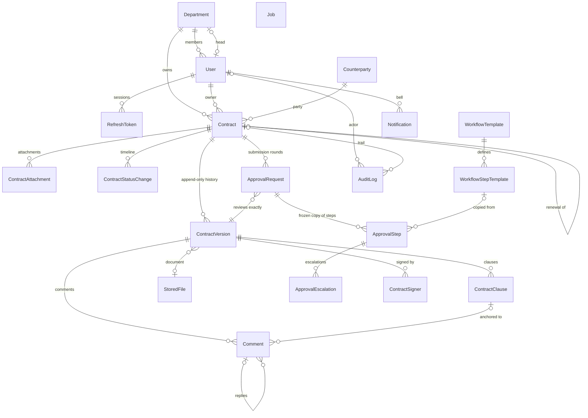

# Architecture

## Repository layout

```
contract-management/
├── apps/
│   ├── api/                 Express + TypeScript + Prisma (layered, feature modules)
│   │   ├── prisma/          schema.prisma, migrations/, seed.ts
│   │   └── src/
│   │       ├── config/      env parsing (zod), fail-fast on bad config
│   │       ├── lib/         prisma client, logger, mailer, storage providers
│   │       ├── common/      errors, middleware (auth, rbac, validation, audit context)
│   │       ├── jobs/        Postgres-backed job worker + schedulers (expiry, escalation)
│   │       └── modules/
│   │           └── <feature>/
│   │               ├── <feature>.routes.ts       HTTP wiring only
│   │               ├── <feature>.controller.ts   parse/validate request → call service
│   │               ├── <feature>.service.ts      business rules, transactions
│   │               ├── <feature>.repository.ts   Prisma queries only
│   │               └── <feature>.schemas.ts      zod request/response schemas
│   └── web/                 Angular (standalone components, feature folders, signals)
├── packages/
│   └── shared/              enums + contract transition table used by API *and* UI
├── docs/
└── docker-compose.yml       Postgres + Mailpit (SMTP catcher)
```

**Why a monorepo (npm workspaces)?** One clone, one `npm install`, and one place
for the domain vocabulary. `@cms/shared` holds the status enums and the contract
transition table, so the UI decides which action buttons to show from the same
graph the server enforces. No Nx/Turborepo: npm workspaces are enough at this
size, and each extra tool is one more thing a reviewer has to learn.

**Why layered modules in the API?** Controllers know HTTP, services know the
business, repositories know Prisma. The workflow engine's core is plain functions
with no DB or HTTP dependencies, which is why it can be unit-tested
exhaustively.

## Data model



### Key decisions

1. **Current state plus immutable history.** `Contract` is the mutable "head"
   (status plus a denormalized copy of the current version's fields, so list,
   filter and dashboard queries need no joins). `ContractVersion` rows are
   insert-only snapshots. Both are written in one transaction by
   `ContractService`, the only writer. `@@unique([contractId, versionNumber])`
   also works as an optimistic-concurrency guard: two simultaneous edits can't
   both create version N+1.

2. **Workflow definitions vs. instances.** `WorkflowTemplate` and
   `WorkflowStepTemplate` are the configurable policy. On submit, the engine
   picks the most specific template (type+department > type > default),
   evaluates each step's `condition` (for example
   `{ field: "value", op: "gt", value: 10000 }` for Finance), and materializes
   `ApprovalStep` rows. Steps whose condition fails are stored as `SKIPPED` with
   a human-readable `skipReason`. Editing a policy later never affects
   contracts already in review.

3. **Stages allow parallel approval.** Steps with the same `stage` run in
   parallel, and every step in a stage must approve before the next stage opens.
   "Legal before Manager" is simply Legal = stage 1, Manager = stage 2.

4. **Approvals are bound to a version.** `ApprovalRequest.contractVersionId`
   records exactly what was approved. Editing an approved contract means
   reopening it (APPROVED → DRAFT) and resubmitting. Signers likewise record
   `signedContentHash`, which proves which content they saw.

5. **Every review round is kept.** Rejection closes the `ApprovalRequest` as
   `REJECTED` (remaining steps become `CANCELLED`), and the contract moves to
   `REJECTED`, with the reason in `ContractStatusChange`. The owner revises it
   back to `DRAFT`. Resubmitting creates a *new* request, so the history of
   round 1 stays intact. A partial unique index enforces at most one
   `IN_PROGRESS` request per contract.

6. **Concurrency on decisions.** Decisions are compare-and-set:
   `UPDATE approval_steps SET status='APPROVED' … WHERE id=$1 AND status='PENDING'`.
   If two approvers click at the same moment, one gets a 409 instead of a
   double approval.

7. **Escalation is idempotent.** A scheduler scans `PENDING` steps with
   `dueAt < now()`. Escalation targets are the head of the approver
   department, then Admins. `ApprovalEscalation @@unique([stepId, level, escalatedToId])`
   means re-running the scan can't notify twice.

8. **Postgres job queue (transactional outbox).** Emails are `Job` rows
   inserted *in the same transaction* as the state change. A rolled-back
   approval therefore never sends an email, and a crash after commit never loses
   one. Workers claim jobs with `FOR UPDATE SKIP LOCKED`, and `dedupeKey`
   (e.g. `expiry:<id>:7d`) makes the 30/7/1-day reminders exactly-once.

9. **The audit log is append-only at the database level.** A trigger rejects
   `UPDATE` and `DELETE` on `audit_logs`, so no code path, bug or compromised
   app user can rewrite history. There are no cascading FKs into it, and users
   are deactivated rather than deleted.

10. **Two kinds of history.** `ContractStatusChange` holds the business
    timeline ("how did this contract get here?"). `AuditLog` holds the security
    record ("who viewed or downloaded what, from which IP?"). They answer
    different questions for different audiences.

11. **Clause-level comments.** Template-based contracts are stored as ordered
    `ContractClause` rows with a stable `key` across versions. Comments anchor to
    a clause and optionally to a text quote (`{ exact, prefix, suffix }`, in the
    style of the W3C Web Annotation model), which survives small edits better
    than character offsets.

12. **Storage abstraction.** `StoredFile.storageKey` is opaque. A
    `StorageProvider` interface (`put/get/delete`) has a local-disk
    implementation now, and an S3 implementation only needs a new class and an
    env switch. The `sha256` of every file is stored.

### Access control

- **RBAC**: each user has one role, and the role → permission map lives in code
  (versioned and reviewable, and fine for five roles).
- **Row-level visibility**: a single `contractVisibilityFilter(user)` builds the
  Prisma `where` clause. Admin sees everything. Other users see their
  department's contracts **plus** contracts where they hold, or can act on, an
  approval step or signature. Without that second clause, the Legal and Finance
  reviewers (in their own departments) couldn't see the contracts they're asked
  to approve.

### Contract lifecycle

```
DRAFT → SUBMITTED → UNDER_REVIEW → APPROVED → SIGNED → ACTIVE → EXPIRED | RENEWED | TERMINATED
             └────────────┴──→ REJECTED → DRAFT (revise)
```

- `SUBMITTED` means submitted, with no decision yet. The first approval moves it
  to `UNDER_REVIEW`.
- Once every signer has signed, the contract becomes `ACTIVE` if its start date
  has passed, otherwise `SIGNED` (the scheduler activates it on the start date).
